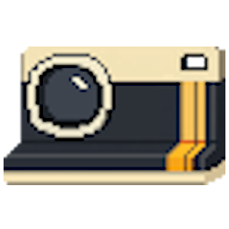
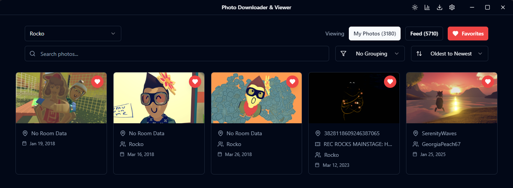
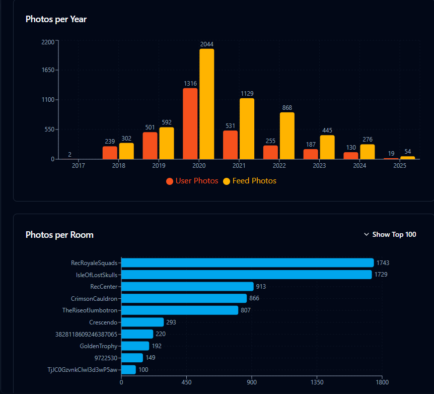

<div align="center">
  
</div>

# RR Image Downloader / Offline Viewer

RR Image Downloader is an Electron + React desktop app for saving Rec Room / Rec.net photos locally, browsing them offline, and keeping useful metadata with the images. It can download user photos, feed photos, profile history images, event albums, and room photo galleries.

**Use this application at your own risk.** Downloading from Rec Room / Rec.net this way may violate their Terms of Service. The app is designed to be data efficient with caching, deduplication, throttling, and skip logic so repeated runs avoid downloading files that are already on disk.

## Current Highlights

- Download user photos, feed photos, profile history images, event photos, and room photos.
- Download photos for all rooms in a `myrooms.json` manifest.
- Select specific rooms from `myrooms.json` instead of downloading every room.
- Add rooms manually by room name or room ID, even if they are not your rooms.
- Resume large room photo scans from the saved cursor or inferred metadata position instead of restarting at the newest page.
- Skip existing images automatically.
- Browse downloaded room photos in pages of 100 thumbnails so very large folders do not overload the UI.
- Sort the room preview across the full local room library before paging.
- Default image preview sort is **Oldest to Newest**.
- Use **First**, **Previous 100**, **Next 100**, and **Last** buttons in the image preview pager.
- During active room downloads, the preview refreshes the newest/latest page automatically. If you manually move to page 2 or later, the viewer anchors that page so new batches do not replace the images you were looking at.
- Collapse the **Download Progress** and **Room photo download list** sections to keep the preview visible.

## Using the App

1. Launch `RR Image Downloader.exe`.
2. Choose or verify your output folder in Settings.
3. The app opens to **Room Photos** by default. Select another mode from the top-left selector if needed:
   - User photos
   - Feed/profile-related photo views
   - Event photos
   - Room Photos
4. Click **Download** or use the controls shown for the selected mode.
5. Browse downloaded photos in the viewer.

## Room Photos

The **Room Photos** tab supports both your room manifest and manually added rooms.

### Download From `myrooms.json`

1. Open the **Room Photos** tab.
2. Choose a `myrooms.json` file or enter its path.
3. Click **Load room list**.
4. Use **Download all room photos** to download every listed room, or select specific rooms and click **Download selected rooms**.

The default manifest path used by this workspace is:

```text
B:\vsCode\rr-exporter-2\myrooms.json
```

### Getting `myrooms.json`

The `myrooms.json` file comes from the Rec.net Data Extractor userscript:

```text
https://greasyfork.org/en/scripts/572412-rec-net-data-extractor
```

To export your owned rooms:

1. Download and install Tampermonkey in your browser:

   ```text
   https://chromewebstore.google.com/detail/tampermonkey/dhdgffkkebhmkfjojejmpbldmpobfkfo
   ```

2. Visit the Tampermonkey extension page and enable **Allow User Scripts**:

   ```text
   chrome://extensions/?id=dhdgffkkebhmkfjojejmpbldmpobfkfo
   ```

3. Visit the Rec.net Data Extractor page:

   ```text
   https://greasyfork.org/en/scripts/572412-rec-net-data-extractor
   ```

4. Click the green **Install this script** button.

5. On the Tampermonkey page it redirects to, click **Install**.

   The page URL will look similar to:

   ```text
   chrome-extension://dhdgffkkebhmkfjojejmpbldmpobfkfo/ask.html?aid=something
   ```

6. Visit `rec.net`.

7. Click the blue **Open Extractor** button at the bottom-left of the screen.

   If you do not see the button, refresh `rec.net`.

8. Click **Export Owned Rooms** at the top.

That export produces the `myrooms.json` file that can be loaded in the **Room Photos** tab.

### Add Other Rooms

Use **Add another room** with either:

```text
^RoomName
```

or:

```text
RoomId
```

Added rooms are merged into the selectable room list so you can download rooms that are not yours.

### Room Download Resume Behavior

Room galleries are fetched newest-to-oldest from Rec.net. For very large rooms, rerunning from page 1 would waste time reprocessing every newer photo. The app now stores and uses room photo cursors. If a cursor is missing, it infers a resume position from the local room metadata count.

For example, if a room has about `146,180` saved metadata records and the page size is `100`, the next scan starts near:

```text
skip=146100
```

The progress and operation logs include the starting skip so you can confirm the run is resuming instead of starting from `skip=0`.

## Image Preview

- The preview renders 100 thumbnails at a time.
- Sorting and search for room photos are applied to the full local room metadata set first, then the current page is returned.
- The viewer only shows room photo cards that have a local `.jpg` on disk, so metadata-only records do not appear as blank image cards.
- Default sort is **Oldest to Newest**.
- Use **First**, **Previous 100**, **Next 100**, and **Last** to move through large libraries.
- If a download is running and you stay on the latest page, the visible images refresh as new batches arrive.
- If you manually navigate away from the default page, the viewer keeps that visible page anchored during refreshes and updates the page number as new images shift your position.

## Data Locations

Downloads live under your chosen output folder:

```text
<output>/
```

Common folders include:

```text
<output>/<accountId>/photos/
<output>/<accountId>/feed/
<output>/<accountId>/profile-history/
<output>/rooms/<roomId>/photos/
<output>/events/<creatorAccountId>/<eventId>/photos/
```

Metadata is stored alongside the images, for example:

```text
<output>/<accountId>/<accountId>_images.json
<output>/<accountId>/<accountId>_feed.json
<output>/rooms/<roomId>/<roomId>_photos.json
<output>/rooms/<roomId>/.folder-meta.json
```

App settings persist at:

```text
~\.recnet-photo-downloader\settings.json
```

The app no longer has a date-based viewer-only cutoff. Download controls remain available normally after launch, including from the default **Room Photos** tab.

## Token Notes

Some downloads may need an access token for private or restricted images.

1. Log in to https://rec.net in your browser.
2. Open Developer Tools with `F12`.
3. Open the Network tab and refresh the page.
4. Search for `account/me`.
5. Copy the `Authorization` header value.
6. Remove the leading `Bearer ` text and paste the token into the app.

Tokens expire. If validation fails, grab a fresh token.

## Troubleshooting

- **The viewer shows no room photos:** Confirm the output folder is correct and that `<output>/rooms/<roomId>/photos/` contains `.jpg` files.
- **Oldest to Newest shows blank cards:** The viewer should now skip metadata-only records. Rebuild and relaunch the root executable if you still see old behavior.
- **A room scan starts at `skip=0`:** Check the operation logs. Normal large-room resume should show a nonzero starting skip when metadata or cursor data already exists.
- **Progress panel takes too much space:** Collapse **Download Progress**.
- **Room list takes too much space:** Collapse **Room photo download list**.
- **Validation errors or 401s:** Fetch a fresh token and make sure it matches the account or room access you need.
- **Rate limits or slow responses:** Increase request delay in Settings.
- **Output folder permission errors:** Choose a writable output folder or run the app with permissions that allow writing there.

## Development Setup

Prerequisites:

- Node.js 18+
- npm

Install dependencies:

```bash
npm install
```

Run in development:

```bash
npm run dev
```

Useful development scripts:

```bash
npm run dev:react-only
npm run dev:electron
npm test
```

## Building

Build and publish the Windows unpacked app into the project root:

```bash
npm run build:win:dir
```

This command:

1. Builds the Electron main process.
2. Builds the React renderer.
3. Packages the app to `dist/win-unpacked`.
4. Copies the packaged runtime back into:

```text
B:\vsCode\rr-exporter-2\rr-image-downloader
```

The root executable is:

```text
B:\vsCode\rr-exporter-2\rr-image-downloader\RR Image Downloader.exe
```

The root publish step is handled by:

```bash
npm run publish:root
```

Other build scripts:

```bash
npm run build
npm run build:win
npm run build:mac
npm run build:linux
npm run build:all
```

## Screenshots

### Favorite Photo Album

<div align="center">
   
</div>

### Stats

<div align="center">
  
</div>

## License

MIT
